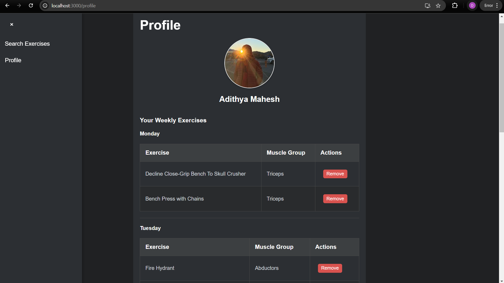

# Gym Exercise Search Application

## Overview

The **Gym Exercise Search Application** is a dynamic full-stack web application designed to help fitness enthusiasts efficiently search, plan, and manage their gym exercises. This project leverages **React** for a seamless user experience on the frontend and **Django** with **Elasticsearch** on the backend to provide fast and accurate search results.

Users can search for exercises based on body parts and skill levels, add exercises to their weekly workout plans, and manage their fitness profile.

---

## Features

1. **Search Functionalities**:
   - Search exercises by **body part** (e.g., Biceps, Chest, Quadriceps).
   - Filter exercises based on **difficulty level** (Beginner, Intermediate, Advanced, Expert).

2. **Workout Planning**:
   - Add exercises to your weekly workout schedule.
   - View exercises and associated details in a modal pop-up.

3. **Profile Management**:
   - Manage personal workout plans through a dedicated profile section.

4. **Powered by Elasticsearch**:
   - Optimized and fast search queries using Elasticsearch.
   - Backend monitored and managed via Kibana.

5. **User-Friendly Interface**:
   - Responsive, intuitive design built with React.

---

## Dependencies

The project requires the following dependencies to run successfully:

### Frontend Dependencies:
- **React**: Frontend library for building UI components.
- **Axios**: For making API requests to the backend.

### Backend Dependencies:
- **Django**: Backend framework for handling API requests.
- **Django REST Framework**: To build and manage APIs.
- **Elasticsearch**: For storing and retrieving exercise data.
- **Kibana**: For monitoring and visualizing Elasticsearch data.

---

## Screenshots

### 1. Elasticsearch Through Kibana


### 2. Exercise Search Page


### 3. User Profile Section


---

## How to Run the Project

### Prerequisites

Ensure you have the following installed on your machine:
- **Node.js** (v14 or higher)
- **npm** or **yarn**
- **Python 3.x**
- **Elasticsearch** (v7.x or compatible version)
- **Kibana** (to monitor Elasticsearch)
- **Git** (to clone the repository)

---

## Known Issues
- Ensure the Elasticsearch service is running before making API calls.
- Update the elasticsearch.yml configuration file for CORS issues if running in a different domain.
- Update the Elasticsearch password in indexing.py and run it to upload the JSON dataset to Elasticsearch.

### Steps to Run

#### 1. Clone the Repository
```bash
git clone https://github.com/your-username/gym-exercise-search.git
cd gym-exercise-search
